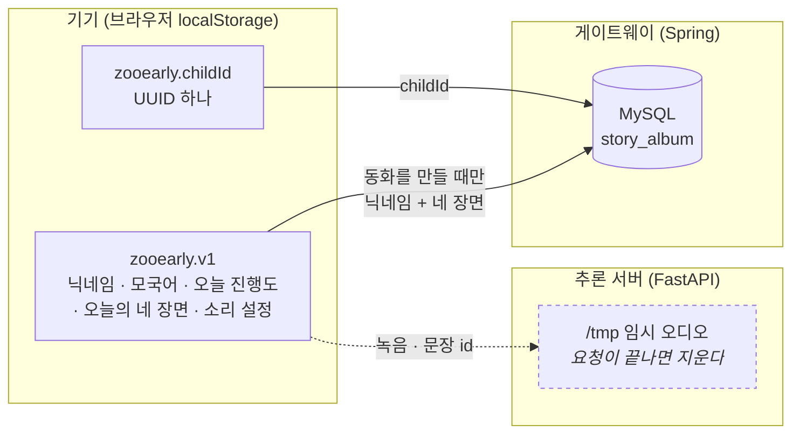
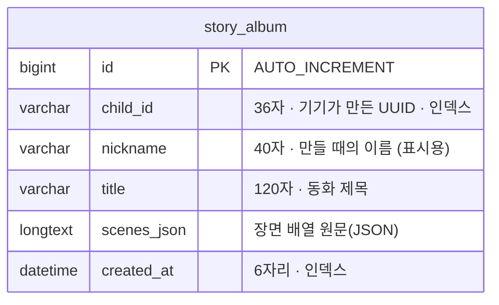
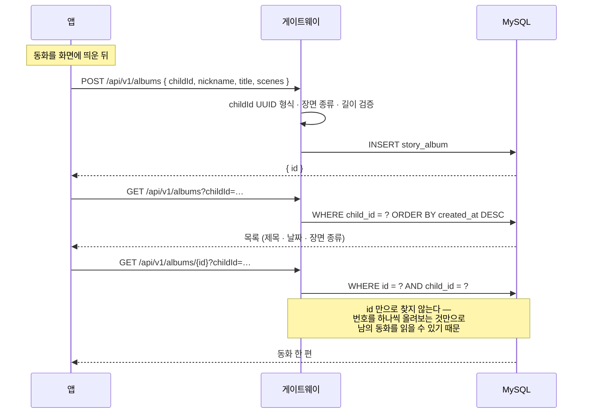

# ERD — 쥬얼리(ZooEarly) 데이터 구조

표는 **하나**다. 그래서 이 문서의 반은 "무엇을 저장하지 *않는가*"에 대한 것이다.
저장하지 않기로 한 판단이 이 서비스의 성격을 만든다.

---

## 1. 전체 그림 — 데이터가 어디에 사는가



**기기가 원본이다.** 아이의 이름·모국어·오늘 어디까지 했는지는 전부 브라우저에 있고
서버는 모른다. 서버로 나가는 것은 그때 필요한 것뿐이다 — 채점은 녹음과 문장 id,
동화는 닉네임과 네 장면.

**남는 것은 동화뿐이다.** 녹음은 `/tmp` 에 잠깐 썼다가 요청이 끝나면 지운다.
진행도와 모국어는 애초에 서버로 나가지 않는다.

---

## 2. 표



```sql
CREATE TABLE `story_album` (
  `id`          bigint       NOT NULL AUTO_INCREMENT,
  `child_id`    varchar(36)  NOT NULL,
  `nickname`    varchar(40)  NOT NULL,
  `title`       varchar(120) NOT NULL,
  `scenes_json` longtext     NOT NULL,
  `created_at`  datetime(6)  NOT NULL,
  PRIMARY KEY (`id`),
  KEY `idx_album_child_created` (`child_id`, `created_at`)
) ENGINE=InnoDB DEFAULT CHARSET=utf8mb4 COLLATE=utf8mb4_unicode_ci;
```

### 왜 표가 하나인가

장면(scene)을 따로 표로 빼지 않았다. 장면은 **동화와 함께 태어나 함께 읽힌다** —
장면만 조회하거나 수정할 일이 없고, 검색 조건이 되지도 않는다. 표를 나누면 조인만
늘고 얻는 것이 없다. `scenes_json` 은 추론 서버가 만든 모양을 그대로 담으므로,
그쪽 스키마가 늘어나도 이 표는 손댈 일이 없다.

### `scenes_json` 안의 모양

```jsonc
[
  {
    "category": "school_arrival",   // 삽화를 고르는 유일한 키
    "subtitle": "학교 오는 길",
    "opening":  "아침에",
    "quote":    "안녕! 우리 같이 놀자!",  // 아이가 실제로 고른 말 · null 가능
    "narration": "지우가 학교에 왔어요."
  }
  // … 보통 4개 (등교 · 수업 · 급식 · 하교)
]
```

`category` 는 `school_arrival` · `class` · `lunch` · `school_departure` 넷 중 하나다.

---

## 3. 저장하지 않는 것과 그 이유

| 저장하지 않는 것 | 왜 |
|---|---|
| **삽화 이미지** | LLM 생성물이 아니라 앱 번들의 정적 PNG 6장이고, `category` 하나로 결정된다. 넣으면 동화마다 같은 파일을 복제하면서, 나중에 그림을 고쳐도 옛 앨범만 낡은 그림으로 남는다 |
| **녹음 오디오** | 게이트웨이는 스트림째 흘려보내고, 추론 서버는 `/tmp` 에 잠깐 썼다가 요청이 끝나면 지운다 |
| **진행도 · 모국어** | 서버로 나가지도 않는다. 기기에만 있다 |
| **표지 · 끝 쪽** | 화면이 만들어내는 고정 문구다. 저장할 값이 없다 |

---

## 4. 키 설계 — 왜 닉네임이 아니라 UUID 인가

로그인이 없다. "누구인가"는 결국 기기가 정한다.

| | 닉네임 | `child_id` (UUID) |
|---|---|---|
| 겹치나 | **겹친다** — 같은 반에 "지우"가 둘이면 앨범이 섞인다 | 겹치지 않는다 |
| 바뀌나 | **바뀐다** — 메뉴에서 이름을 고치면 과거 앨범을 잃는다 | 바뀌지 않는다 |
| 무엇을 알려주나 | 아이 이름이 모든 조회 주소에 실린다 | 그 자체로는 아무것도 |

`nickname` 은 표시용 칼럼으로만 남는다 — **그때 그 이름**이라, 나중에 이름을 바꿔도
옛 동화의 표지는 그대로다.

### childId 를 프로필과 다른 키에 저장하는 이유

| localStorage 키 | 언제 지워지나 |
|---|---|
| `zooearly.v1` (프로필·진행도) | 날짜가 바뀌면 진행도가 비워지고, "처음부터 플레이하기"로 통째로 지워진다 |
| `zooearly.childId` | **날짜가 바뀌어도 남는다.** 단, "처음부터 플레이하기"에서는 새로 만든다 |

날짜가 바뀔 때 앨범까지 잃으면 안 되므로 따로 뒀다. 반대로 "처음부터 플레이하기"는
기기를 **다음 아이에게 넘기는** 동선이라 그때는 신원도 새로 만든다 — 안 그러면 다음
아이가 앞 아이의 동화를 열어보게 된다. 앞 아이의 동화는 서버에 남지만 아무도 그
`child_id` 를 모르므로 닿을 수 없다.

---

## 5. 인덱스

```
PRIMARY KEY (id)
KEY idx_album_child_created (child_id, created_at)
```

앨범 조회는 언제나 **"이 아이의 것을 최신순으로"** 다. 두 칼럼을 함께 태워
목록 조회가 인덱스만으로 끝나게 했다.

`child_id` 단독 인덱스는 두지 않았다 — 복합 인덱스의 앞부분이 그 역할을 한다.

---

## 6. 접근 규칙 — 인증이 없으므로 childId 가 열쇠다



- **조회에도 `child_id` 를 함께 요구한다.** 없으면 번호 열거만으로 남의 동화가 열린다.
- **`child_id` 는 UUIDv4 형식을 검사한다.** 아무 문자열이나 받으면 인덱스를 훑는 헛질의만 는다.
- **한 아이당 500편 상한.** 인증이 없어 `childId` 를 바꿔가며 무한히 밀어 넣을 수 있다.

---

## 7. 어디에 사는가

| | 어디 |
|---|---|
| 로컬 | 도커 `zooearly-mysql` (MySQL 8.4) · `localhost:3306` |
| Azure | `zooearly-db-df3ae5.mysql.database.azure.com` · Burstable B1ms · 20GB · koreacentral |
| 테스트 | 메모리 DB(H2, MySQL 모드) — **도커 없이도 돈다** |

배포 절차와 비용은 [`DEPLOY.md`](../../../DEPLOY.md).

> H2 에는 `TINYTEXT` 같은 길이 제한이 없다. 그래서 **칼럼 타입 사고는 테스트로 안 잡힌다** —
> 아래 회귀 테스트가 스모크 테스트(실제 MySQL)에도 함께 들어 있는 이유다.

---

## 8. 이 표에 남은 판단들 (실패해서 배운 것)

| 하지 말 것 | 무슨 일이 났나 |
|---|---|
| `scenes_json` 을 **JSON 칼럼**으로 잡기 | 문자열이 다시 JSON 문자열로 감싸여, 읽을 때 배열이 아니라 따옴표 붙은 문자열이 돌아왔다 |
| `@Lob` 만 붙이고 길이를 안 주기 | MySQL 에서 **TINYTEXT(255바이트)** 가 됐다. 동화 한 편은 몇 KB 라 그대로 잘린다. 메모리 DB(H2)에는 그 제한이 없어 테스트만으로는 드러나지 않았다 |

지금은 `columnDefinition = "LONGTEXT"` 로 못박고, 긴 동화가 잘리지 않는지 보는
회귀 테스트를 뒀다(`AlbumApiTest.keepsLongStoryIntact`, `scripts/smoke-test.mjs`).
